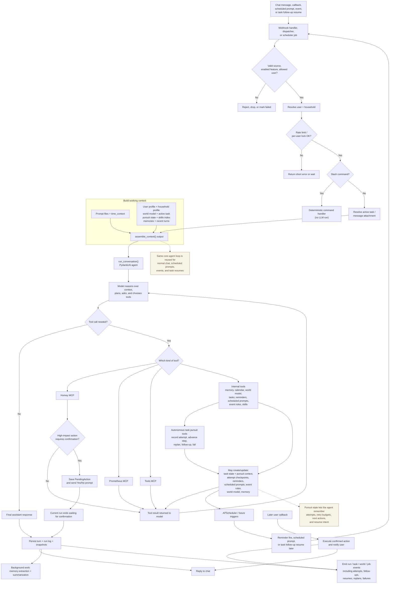

# Agent Flow

This page shows the end-to-end runtime path for HomeAgent: from the moment a
chat or scheduled trigger arrives, through context assembly and tool use, to the
response, persistence, and any future continuation work.

Preview:

---

## What This Diagram Shows

### 1. Ingress and safety checks

The flow begins when HomeAgent receives:

- a normal chat message
- a confirmation callback
- a scheduled prompt fire
- a task-resume trigger

Before the agent runs, the runtime still applies the usual guardrails:

- source validation
- allowlist / feature checks
- user resolution
- rate limiting / per-user serialization
- slash-command interception

### 2. Context building

For normal agent runs, the runtime assembles context from:

- prompt files and time context
- user profile
- household profile
- household world model
- active task context
- available skills index
- relevant episodic memories
- recent conversation turns and summary

This is what makes the single-agent design work.

### 3. The model/tool loop

The agent does not just "answer once". It can loop through:

- reasoning over the built context
- deciding whether it needs tools
- calling MCP or internal tools
- receiving results back into the same run

This may repeat multiple times before the final answer is produced.

### 4. Policy gate and side effects

High-impact Homey actions are screened by the policy gate.

- safe/read-style work proceeds immediately
- risky actions can pause behind a pending confirmation
- the later callback path executes the confirmed action outside the original run

### 5. Tasks, reminders, and scheduled prompts

Internal tools can create or update:

- multi-step tasks
- reminders
- scheduled prompts
- event rules
- skill lookups
- future task resumes

Those future triggers come back into the system later and re-enter the runtime
through the same top-level flow.

### 6. Persistence and background work

After the run:

- the full turn is saved
- run logs and snapshots are updated
- admin/observability events are emitted
- memory extraction and summarization run in the background

---

## Mermaid Source

