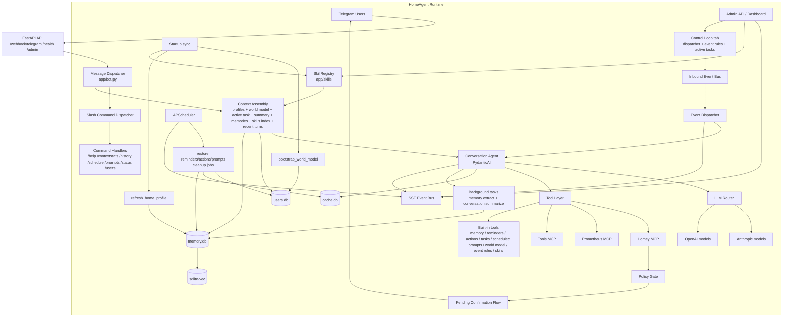
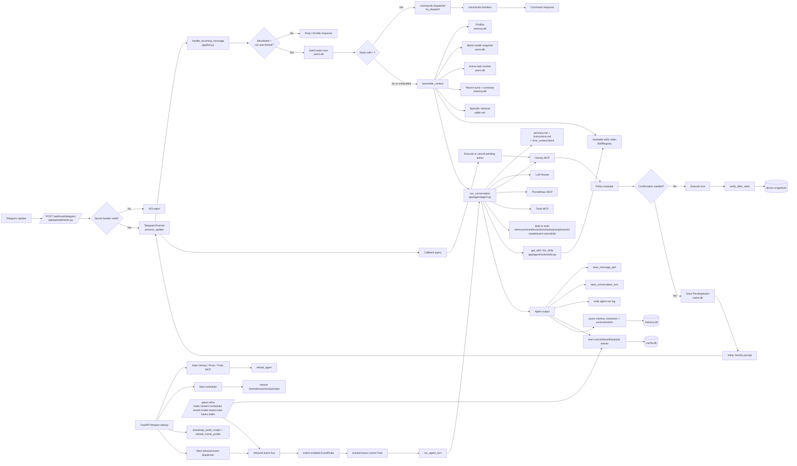
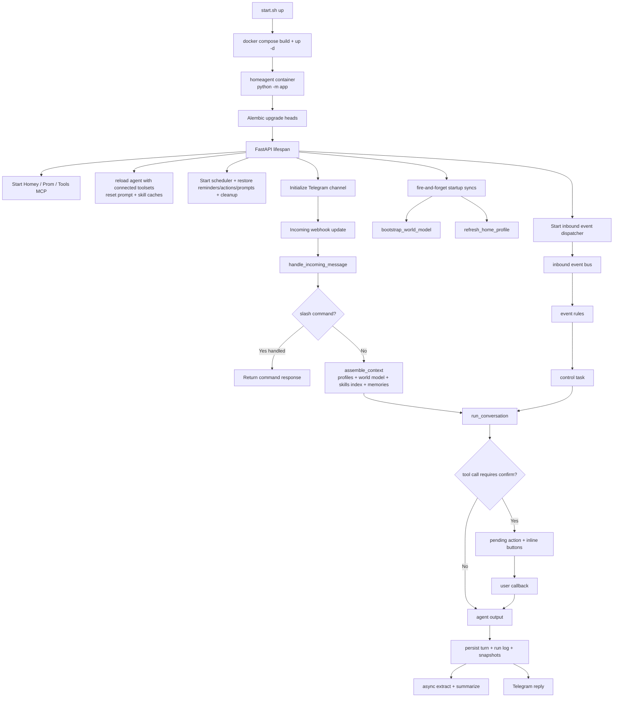
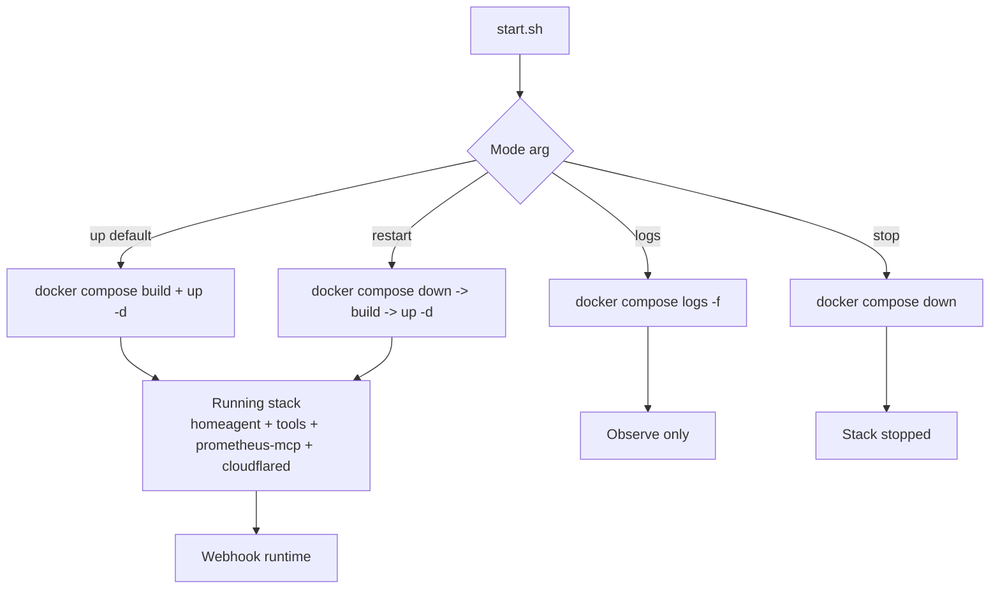

# Architecture Diagrams

This document provides text diagrams for the current HomeAgent codebase. The Mermaid diagrams below are kept in sync with the runtime more often than the exported SVGs.

SVG exports currently in the repo:

- `docs/diagrams/architecture-high-level.svg`
- `docs/diagrams/architecture-detailed.svg`
- `docs/diagrams/main-path-startup-and-one-message.svg`
- `docs/diagrams/dev-vs-prod-from-start-sh.svg`
- `docs/diagrams/agent-flow.svg`

Preview:

---

## High-Level Architecture

---

## Detailed Software Architecture

---

## Startup and One Message Path

---

## `start.sh` Mode Matrix

