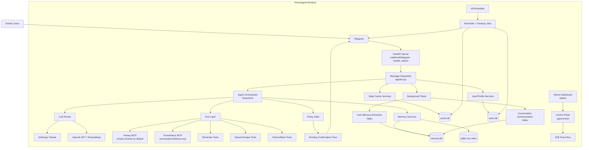
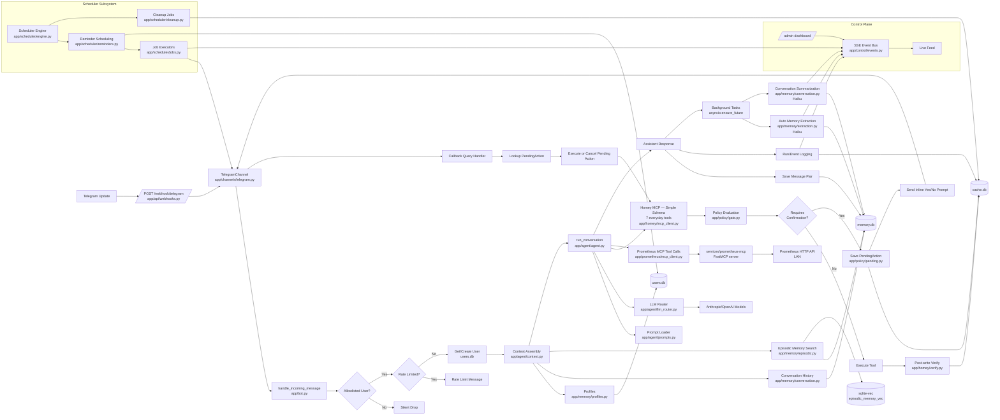

# Architecture Diagrams

This document provides two architecture drawings based on the current HomeAgent codebase:

- High-level system architecture
- Detailed software architecture (runtime components and data flow)

SVG exports (generated from Mermaid source below):

- `docs/diagrams/architecture-high-level.svg`
- `docs/diagrams/architecture-detailed.svg`
- `docs/diagrams/main-path-startup-and-one-message.svg`
- `docs/diagrams/dev-vs-prod-from-start-sh.svg`

Preview:

---

## High-Level Architecture

---

## Detailed Software Architecture

