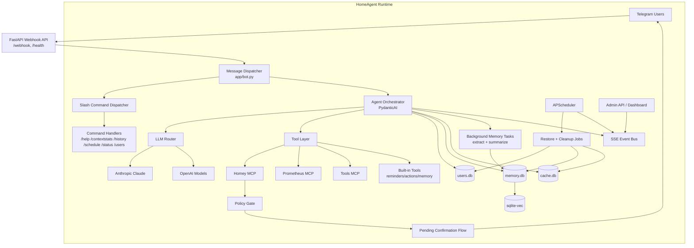
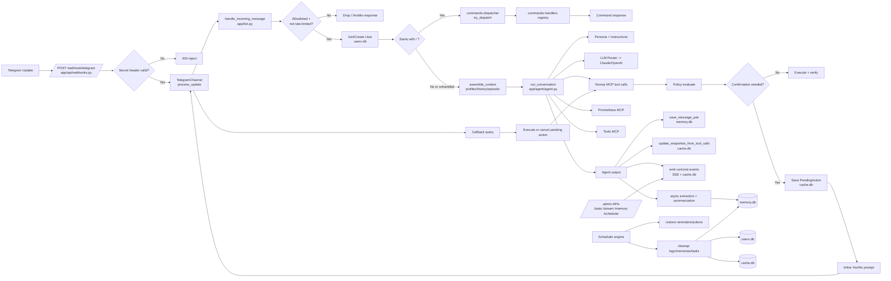

# Architecture Diagrams

This document provides architecture and flow drawings based on the current HomeAgent codebase.

SVG exports:

- `docs/diagrams/architecture-high-level.svg`
- `docs/diagrams/architecture-detailed.svg`
- `docs/diagrams/main-path-startup-and-one-message.svg`
- `docs/diagrams/dev-vs-prod-from-start-sh.svg` *(now documents current `start.sh` mode matrix)*

Preview:


---

## High-Level Architecture



---

## Detailed Software Architecture



---

## Startup and One Message Path

```mermaid
flowchart TB
    START[start.sh up] --> DC[docker compose build + up -d]
    DC --> APP[homeagent container\npython -m app]
    APP --> MIG[Alembic upgrade heads]
    MIG --> RUN[_run(): main webhook app + admin app]

    RUN --> LIFE[FastAPI lifespan startup]
    LIFE --> MCP[Start Homey/Prom/Tools MCP]
    LIFE --> SCH[Start scheduler + restore jobs + cleanup registration]
    LIFE --> TG[Initialize TelegramChannel]

    TG --> WH[Incoming webhook update]
    WH --> MSG[handle_incoming_message]
    MSG --> CMD{slash command?}
    CMD -->|Yes handled| CR[Return command response]
    CMD -->|No| AG[assemble_context + run_conversation]
    AG --> POL{Homey write needs confirm?}
    POL -->|Yes| PEND[pending action + inline buttons]
    POL -->|No| OUT[agent output]
    PEND --> CB[user callback]
    CB --> OUT

    OUT --> SAVE[persist messages + snapshots + run logs]
    SAVE --> BG[async memory extraction/summarization]
    SAVE --> REPLY[Telegram reply]
```

---

## `start.sh` Mode Matrix (Current)

```mermaid
flowchart TB
    SH[start.sh] --> MODE{Mode arg}

    MODE -->|up (default)| UP[docker compose build && up -d]
    MODE -->|logs| LOGS[docker compose logs -f]
    MODE -->|stop| STOP[docker compose down]
    MODE -->|restart| RESTART[docker compose down -> build -> up -d]

    UP --> STACK[Running stack: tools + homeagent + cloudflared]
    RESTART --> STACK

    STACK --> RUNTIME[Webhook runtime\n(homeagent APP_ENV=production)]

    LOGS --> OBS[Observe only\nno state change]
    STOP --> DOWN[Stack stopped]
```
