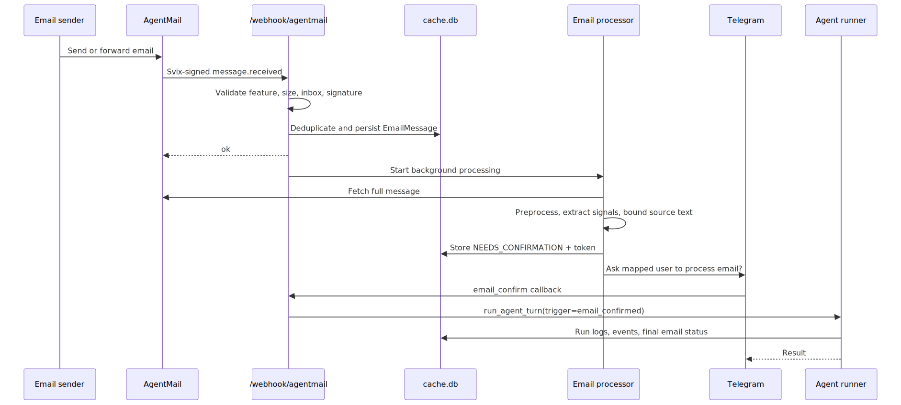
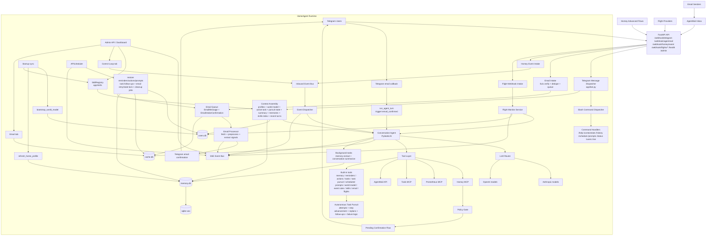
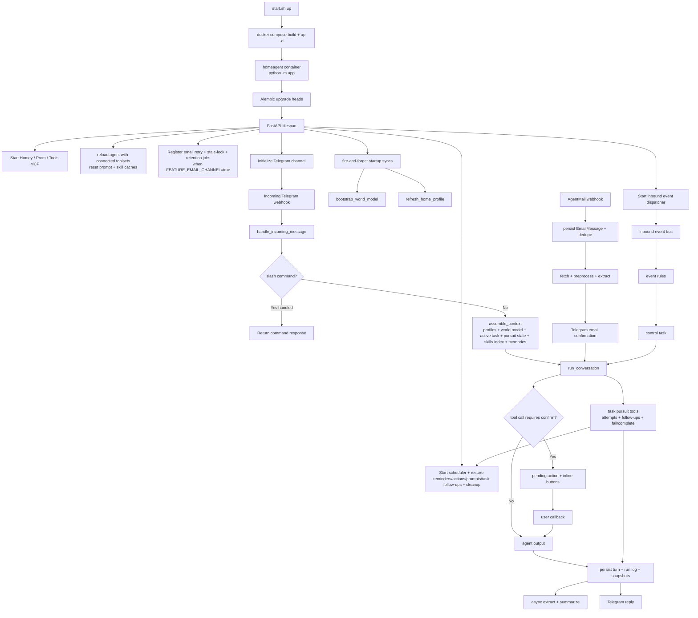
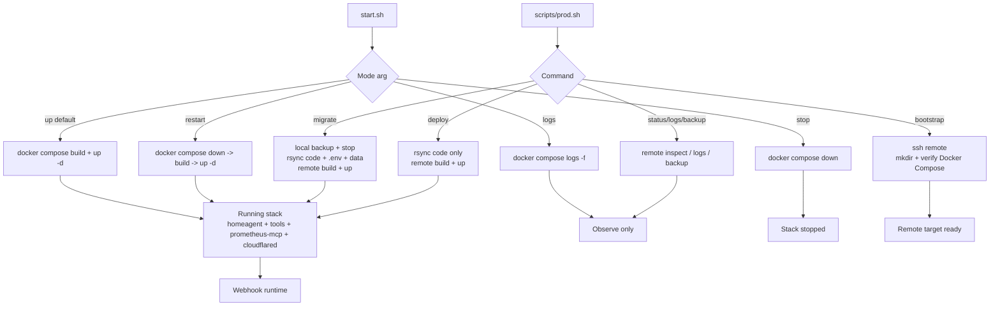
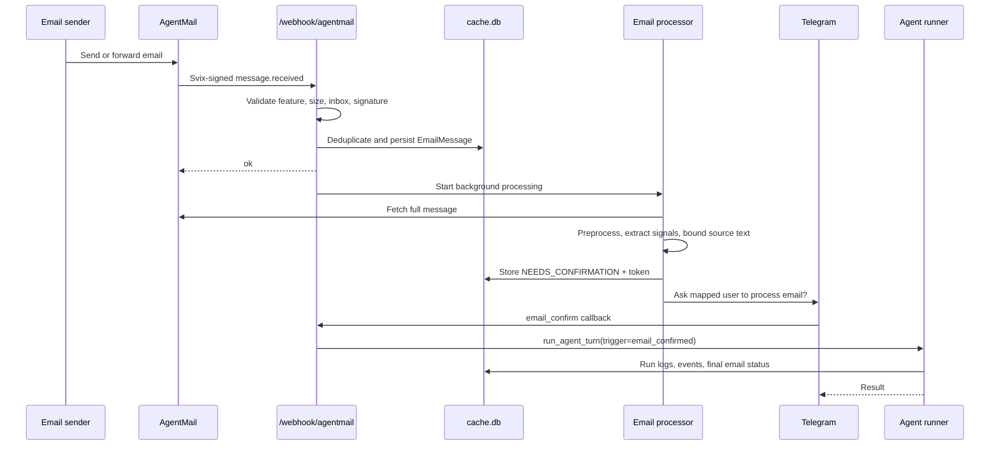
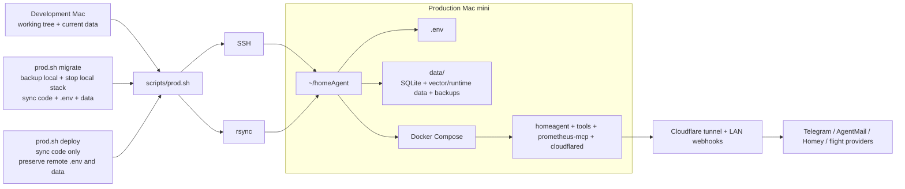

# Architecture Diagrams

This document provides text diagrams for the current HomeAgent codebase. The Mermaid diagrams below are the source of truth for the exported SVGs.

SVG exports currently in the repo:

- `docs/diagrams/architecture-high-level.svg`
- `docs/diagrams/architecture-detailed.svg`
- `docs/diagrams/architecture-layered-components.svg`
- `docs/diagrams/main-path-startup-and-one-message.svg`
- `docs/diagrams/dev-vs-prod-from-start-sh.svg`
- `docs/diagrams/agent-flow.svg`
- `docs/diagrams/autonomous-task-pursuit.svg`
- `docs/diagrams/email-intake-flow.svg`
- `docs/diagrams/mac-mini-deployment.svg`

Preview:

---

## High-Level Architecture

---

## Layered Components Architecture

This SVG is hand-authored rather than Mermaid-generated so the drawing can keep a conventional architecture layout: external interfaces at the top, application/runtime/core layers in the middle, persistence at the bottom, and a support/control plane on the side spanning the stack.

---

## Detailed Software Architecture

```mermaid
flowchart LR
    TGU[Telegram Update] --> WH[/POST /webhook/telegram<br>app/api/webhooks.py/]
    WH --> SEC{Secret header valid?}
    SEC -->|No| REJ[403 reject]
    SEC -->|Yes| CH[TelegramChannel<br>process_update]
    CH --> BOT[handle_incoming_message<br>app/bot.py]

    BOT --> ACL{Allowlisted +<br>not rate-limited?}
    ACL -->|No| DROP[Drop / throttle response]
    ACL -->|Yes| USER[Get/Create User<br>users.db]

    USER --> CMDCHK{Starts with slash?}
    CMDCHK -->|Yes| DISPATCH[commands.dispatcher<br>try_dispatch]
    DISPATCH --> CMDH[commands.handlers]
    CMDH --> CMDRESP[Command response]

    CMDCHK -->|No or unhandled| CTX[assemble_context]
    CTX --> PROF[Profiles<br>memory.db]
    CTX --> WORLD[World model snapshot<br>users.db]
    CTX --> TASKCTX[Active task + pursuit context<br>users.db]
    CTX --> HIST[Recent turns + summary<br>memory.db]
    CTX --> MEM[Episodic retrieval<br>sqlite-vec]
    CTX --> SKIDX[Available skills index<br>SkillRegistry]

    CTX --> RUN[run_conversation<br>app/agent/agent.py]
    RUN --> PROMPTS[persona.md + instructions.md<br>+ time_context block]
    RUN --> MODEL[LLM Router]
    RUN --> MCPHOMEY[Homey MCP]
    RUN --> MCPPROM[Prometheus MCP]
    RUN --> MCPTOOLS[Tools MCP]
    RUN --> BUILTIN[Built-in tools<br>memory/reminders/actions/tasks/task-pursuit/prompts/world-model/event-rules/skills/email/flights]
    BUILTIN --> PURSUIT[Task pursuit operations<br>record attempt / advance step / replan / follow-up / fail]
    SKTOOL[get_skill / list_skills<br>app/agent/tools/skills.py] --> SKIDX
    RUN --> SKTOOL

    MCPHOMEY --> POL[Policy evaluate]
    POL --> NEED{Confirmation needed?}
    NEED -->|No| EXEC[Execute tool]
    NEED -->|Yes| SAVEPA[Save PendingAction<br>cache.db]
    SAVEPA --> INLINE[Inline Yes/No prompt]
    INLINE --> CH

    CH --> CALLBACK[Callback query]
    CALLBACK --> CONFIRM[Execute or cancel pending action]
    CONFIRM --> MCPHOMEY

    EXEC --> VERIFY[verify_after_write]
    VERIFY --> SNAP[(device snapshots)]

    AMEV[AgentMail Svix Event] --> AMWH[/POST /webhook/agentmail/]
    AMWH --> AMSEC{Feature + size +<br>Svix/inbox valid?}
    AMSEC -->|No| AMREJ[Reject or ignore]
    AMSEC -->|Yes| AMDEDUP[Deduplicate delivery + message ids]
    AMDEDUP --> AMROW[Persist EmailMessage<br>cache.db]
    AMROW --> AMPROC[process_email_message]
    AMPROC --> AMFETCH[Fetch full message<br>AgentMail API]
    AMFETCH --> AMMAP[Resolve sender via<br>ChannelMapping email]
    AMMAP --> AMPRE[Preprocess + extract signals]
    AMPRE --> AMPROMPT[Telegram email intake prompt]
    AMPROMPT --> CH
    CH --> AMCB[Callback email_confirm/email_cancel]
    AMCB --> RUNNER[run_agent_turn<br>trigger=email_confirmed]
    RUNNER --> RUN

    RUN --> RESP[Agent output]
    RESP --> SAVEPAIR[save_message_pair]
    RESP --> SAVETURN[save_conversation_turn]
    RESP --> RUNLOG[write agent run log]
    RESP --> EVT[emit run/cmd/world/task/job/email/flight events]
    RESP --> BG[async memory extraction + summarization]

    BG --> DBM[(memory.db)]
    EVT --> DBC[(cache.db)]

    START[FastAPI lifespan startup] --> MCPSTART[Start Homey / Prom / Tools MCP]
    MCPSTART --> RELOAD[reload_agent]
    START --> SCH[Start scheduler]
    SCH --> RESTORE[restore reminders/actions/prompts/task follow-ups<br>register email worker jobs]
    START --> BOOT[bootstrap_world_model + refresh_home_profile]
    START --> EDISP[Start inbound event dispatcher]
    EDISP --> EB[Inbound event bus]
    EB --> MATCH[match enabled EventRules]
    MATCH --> CTRL[resolve/reuse control Task]
    CTRL --> RUNNER
    PURSUIT --> TASKCTX
    PURSUIT --> EVT
    PURSUIT --> SCH

    ADMIN[/admin APIs<br>/stats /stream /scheduler /world-model /event-rules /tasks /skills /email/] --> EVT
    ADMIN --> EB
```

---

## Startup and One Message Path

---

## `start.sh` / `prod.sh` Mode Matrix

---

## Email Intake Flow

---

## Mac Mini Deployment

