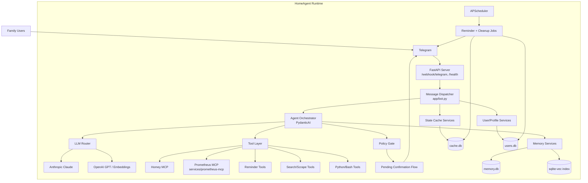
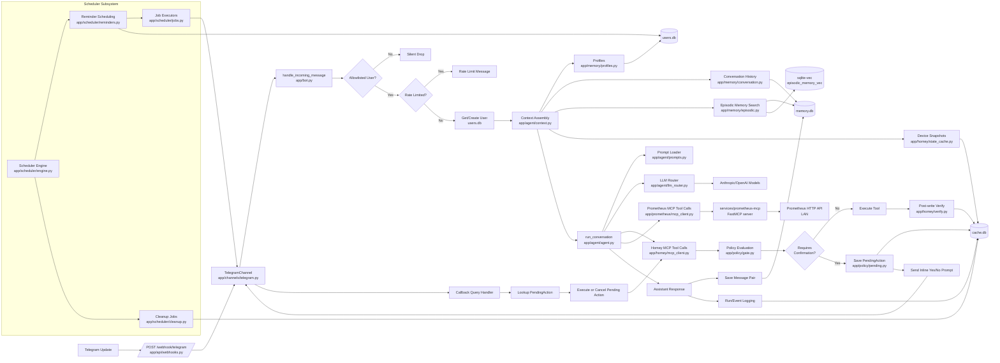

# Architecture Diagrams

This document provides two architecture drawings based on the current HomeAgent codebase:

- High-level system architecture
- Detailed software architecture (runtime components and data flow)

---

## High-Level Architecture

---

## Detailed Software Architecture

